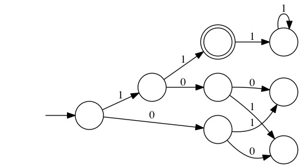

# CSC410 Project: Inferring Automata using State-merging

## Required packages

Download, build, and add to dependencies (we used IntelliJ)

### dk.brics.automaton

[Use this one (mutable Transition class)](https://github.com/StivoEgg/dk.brics.automaton)

### Apache Common CLI

https://commons.apache.org/proper/commons-cli/index.htm

### JUnit 5

http://junit.org/junit5/


## Usage

```
Usage: mergeDFA [Automaton File] [k States]
Options:
 -d <Filename>   Save Graphviz Dot representation of reduced DFA
 -e <Filename>   Use examples from file, otherwise use generated random
                 examples
 -m              Reduce DFA using most-cons instead of default R-Shrink
 -r              Output each step in R-shrink
 -s <Filename>   Save string representation of reduced DFA
 ```

 ### Automaton File Template
```
 [statename] [initial?] [accept?] [transitions...]
 [statename] [initial?] [accept?] [transitions...]
```
 Example:

 ```
s1 Y N 1-s2 0-s3
s2 N N 1-s4 0-s5
s3 N N 1-s6 0-s7
s4 N Y 1-s8
s5 N N 1-s7 0-s6
s6 N N
s7 N N
s8 N N 1-s8
 ```

 